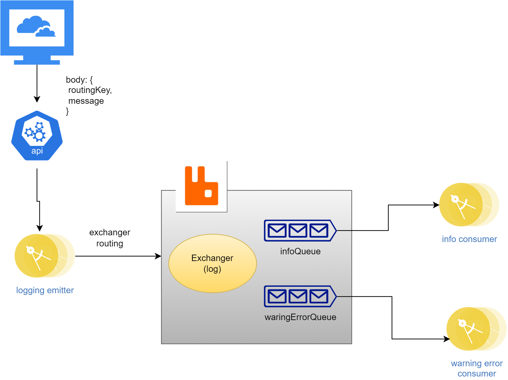

# Microservices using RabbitMQ Using node.js

## Start
   1. you have 2 folders (logger_emitter, linsters)
      1. logger_emitter that send the messages
      2. listers, consume the messages
   2. in each one install node packages using
   ```bash
    npm install
   ```
   3. you need also RabbitMQ install in your machine
      - you can use Docker
        ```back
        Docker container create --name kera -p 5672:5672 rabbitmq:3.9-management
        Docker container start kera
        ```
   4. you can run the producer server using 
   ```bash
    npm run dev
   ```
   5. you can start the info consumers using
   ```bash
    node info
   ```
   6. you can start the warning error consumers using
   ```bash
    node warning error
   ```
   7. you can send logging by
   ```bash
    curl -X POST -H "Content-Type: application/json" -d '{"routingKey": "info", "message": "try rabbitmq"}' "http://localhost:3000/send_log"
   ```
   8. exchange between ['info', 'error', warning] in the routingKey, and change the message as you want in the previous command
   9. see the output of the emitter and (info_consumer, warning_error_consumer)


## Arch
 
